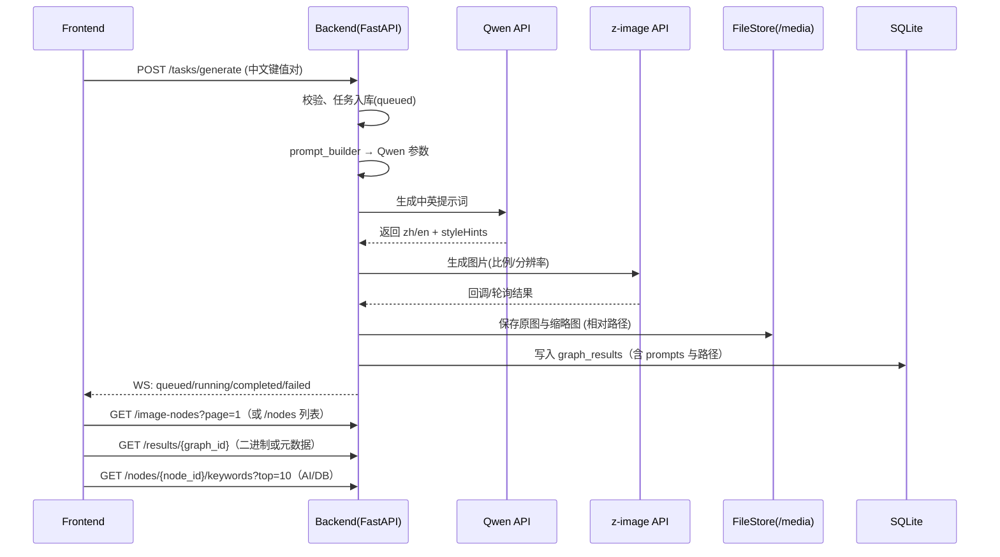

# 保存位置与文件名
- 保存目录：/backend/docs
- 文件名：cineMind-后端接口设计与实现规范.md
- 说明：确认本文档后，文件已保存于上述目录，并据此开始实施开发。

# 1. 环境配置规范
- Conda 虚拟环境
  - 创建：conda create -n cinemind python=3.8
  - 激活：conda activate cinemind
  - 验证：python --version（确保 ≥3.8）
- 依赖记录（双清单）
  - environment.yml（根目录）：固定版本，包含生产与开发依赖；基础生成：conda env export > environment.yml
  - requirements.txt（根目录）：pip freeze > requirements.txt
- 安装约束
  - 仅在 cinemind 环境内使用 pip 安装：pip install -r requirements.txt
  - 禁止在系统全局 Python 环境安装项目依赖
- 从零搭建步骤
  1) 安装 Miniconda/Conda
  2) 创建并激活环境（见上）
  3) pip install -r requirements.txt
  4) 配置环境变量（.env/.env.enc）：QWEN_API_KEY、Z_IMAGE_API_KEY、QWEN_BASE_URL、Z_IMAGE_BASE_URL、BACKEND_HOST、BACKEND_PORT、Is_full_by_AI、USE_REDIS、REDIS_URL
  5) 数据库初始化：python backend/scripts/init_db.py
  6) 启动服务：uvicorn backend.app.main:app --host 0.0.0.0 --port $BACKEND_PORT
- 常见问题与验证
  - SSL/证书错误：设置 HTTPX 超时与验证策略；必要时信任企业代理证书
  - SQLite 权限：确保 backend/cinemind.db 权限 644；容器/WSL 路径映射正确
  - 验证安装：python -c "import fastapi,sqlalchemy,httpx;print('ok')"

## environment.yml（建议草案）
```yaml
name: cinemind
channels:
  - conda-forge
dependencies:
  - python=3.8
  - pip
  - sqlite
  - pip:
      - fastapi==0.95.2
      - uvicorn[standard]==0.30.0
      - pydantic==2.6.4
      - sqlalchemy==2.0.36
      - alembic==1.13.2
      - httpx==0.27.2
      - python-dotenv==1.0.1
      - orjson==3.10.7
      - pytest==8.3.2
      - pytest-cov==5.0.0
      - freezegun==1.5.1
      - redis==5.0.1
      - fastapi-etag==0.4.0
      - pillow==10.4.0
```

# 2. 数据库开发要求
- SQLite 文件：backend/cinemind.db（权限 644）
- 连接池管理（SQLAlchemy Engine）
  - pool_size=5、max_overflow=10、pool_pre_ping=True、connect_args={"timeout": 30}
  - 泄漏检测：统一使用 Session 作用域（依赖注入），请求结束自动关闭
  - 健康检查：GET /health 返回 DB 连接状态
- 迁移与初始化
  - 使用 Alembic 管理迁移（版本化脚本）
  - 初始化脚本：backend/scripts/init_db.py（建库、表、索引）
  - 示例数据：backend/scripts/seed_demo.py

## 表与索引设计
- mind_nodes（思维节点表）
  - node_id UUID PK NOT NULL
  - content TEXT NOT NULL
  - created_at DATETIME DEFAULT CURRENT_TIMESTAMP
  - updated_at DATETIME DEFAULT CURRENT_TIMESTAMP ON UPDATE CURRENT_TIMESTAMP
  - status INTEGER DEFAULT 1
  - 索引：
    - idx_mind_nodes_status(status)
    - idx_mind_nodes_created_at(created_at)
    - 可选全文索引：content（FTS5）
- graph_results（生成图表）
  - graph_id UUID PK NOT NULL
  - related_nodes JSON NOT NULL（关联 mind_nodes 列表/映射）
  - params JSON NOT NULL（比例、分辨率、风格等）
  - prompt_zh TEXT（Qwen 中文提示词）
  - prompt_en TEXT（Qwen 英文提示词）
  - storage_path TEXT NOT NULL（相对：/media/images/...）
  - thumbnail_path TEXT（相对：/media/thumbs/...）
  - mime_type TEXT（image/jpeg|png|webp）
  - size_bytes INTEGER
  - checksum_sha256 TEXT（可选）
  - generated_at DATETIME DEFAULT CURRENT_TIMESTAMP
  - 外键约束：related_nodes 元素需对应 mind_nodes.node_id（应用层校验；如需强约束可使用触发器）
  - 索引：
    - idx_graph_results_generated_at(generated_at)
    - idx_graph_results_mime_type(mime_type)
- tasks（任务状态表）
  - task_id UUID PK NOT NULL
  - external_ref TEXT
  - status TEXT NOT NULL（queued|running|completed|failed）
  - progress REAL DEFAULT 0.0
  - error_code TEXT
  - error_message TEXT
  - created_at DATETIME DEFAULT CURRENT_TIMESTAMP
  - updated_at DATETIME DEFAULT CURRENT_TIMESTAMP

# 3. API 服务开发规范（FastAPI 0.95+）
- 启用 Swagger UI /docs 与 OpenAPI /openapi.json
- CORS：允许前端域名；统一 Content-Type、Request-Id 处理
- 统一响应格式
  - 主格式：{ code, message, data }（code=0 成功）
  - 兼容格式（可选）：{ success, data|error }（通过 Header 或配置切换）
- 错误处理：HTTP 状态码 + 业务错误码（INVALID_PARAM、NOT_FOUND、DB_ERROR、EXTERNAL_SERVICE_ERROR、TIMEOUT、RATE_LIMITED、UNAUTHORIZED、SIGNATURE_INVALID）

## 3.1 思维节点管理（/nodes）
- POST /nodes（创建）
  - 请求：{ content: string, status?: number }
  - 响应：{ code: 0, message: "ok", data: { node_id, content, created_at, updated_at, status } }
- GET /nodes/{node_id}（读取，支持 ETag）
  - 行为：返回资源与 ETag；如 If-None-Match 命中返回 304
- PUT /nodes/{node_id}（更新，乐观锁）
  - 请求：{ content: string, status?: number, version: number }（或基于 updated_at）
  - 冲突：版本不匹配返回业务错误码 CONFLICT 与 409
- DELETE /nodes/{node_id}（软删除）
  - 行为：将 status=0 或 is_deleted=1；保留记录
- GET /nodes（列表查询）
  - 参数：page>=1、size<=100、status?、query?
  - 响应：{ page, size, total, items: [...] }
- GET /nodes/{node_id}/keywords?top=10（关键词服务）
  - 行为：受 Is_full_by_AI 开关控制（见第 6 章）

## 3.2 生成任务与状态（/tasks）
- POST /tasks/generate（提交任务）
  - 请求体：中文键名键值对（严格遵循前端规范）
  - 校验：任务ID UUIDv4、比例 W:H、分辨率 WxH、非空字符串
  - 响应：{ code: 0, message: "accepted", data: { task_id, queued_at } }（HTTP 202）
- GET /tasks/{task_id}（状态查询）
  - 响应：{ code: 0, message: "ok", data: { status, progress, image_id?, error_code?, error_message? } }
- WebSocket /ws/tasks（订阅）
  - 消息：queued|running|completed|failed|heartbeat

## 3.3 结果查询（/results）
- GET /results/{graph_id}
  - Accept: image/* → 返回图片二进制（Content-Type 取自 mime_type）
  - 默认 → 元数据 JSON：{ code: 0, message: "ok", data: { graph_id, storage_path, thumbnail_path, prompts: { zh, en }, params, generated_at } }

## 3.4 目录与文件接口（/media）
- GET /media/tree
  - 返回 media 根目录树（images、thumbs）
- GET /media/tree?type=images&date=YYYY-MM-DD
  - 返回指定日期目录树
- GET /media/files?dir=/media/images/YYYY/MM/DD
  - 返回 FileItem[] 列表（{ name, path, url, mimeType, sizeBytes, checksumSha256?, createdAt }）
- GET /media/file-meta/{graph_id}
  - 返回该结果的文件元数据（DB + FS 汇总）

## 3.5 与前端通信规范兼容
- 别名端点：
  - POST /generate ↔ POST /tasks/generate
  - GET /image-nodes?page=... ↔ GET /nodes（图片分页 Top 20 模式）
- 字段兼容：在 GET /image-nodes 中提供 prompt（中文），扩展 prompts.zh/en，保持前端解析兼容；URL 一律相对路径

# 4. 第三方服务集成
## 4.1 Qwen API 模块
- 参数验证与转换：类型检查、中文键名解析、比例/分辨率规范化
- 产出：符合 z-image 的中英文提示词 { zh, en, styleHints[] }
- 错误与重试：指数退避（1s/2s/4s），熔断（半开恢复），超时 ${timeout}
- 日志：请求/响应耗时与状态，敏感信息脱敏

## 4.2 z-image API 模块
- 参数转换与回调：支持 callback_url；或轮询（可配置间隔与超时）
- 状态跟踪：回调/轮询更新任务状态与 graph_results
- 结果存储与缓存：下载到 backend/media；相对路径入库；可选 Redis 缓存（占位）
- 错误与告警：失败告警钩子（占位）；自动重试与上报

# 5. 开发约束与目录结构
- 仅在 cinemind 虚拟环境中开发与安装依赖
- 代码限定在根目录 backend/ 内；目录结构：
```
/backend
  /app        # 主应用
    /api      # 路由（nodes/tasks/results/media/ws/health）
    /models   # ORM（mind_nodes/graph_results/tasks）
    /schemas  # Pydantic 模型
    /services # qwen/zimage/prompt/keywords/task/redis占位
    /db       # session 与 migrations
    /utils    # validators/errors/logging
    /docs     # OpenAPI增强与静态文档
    /media    # images/thumbs（相对 URL 对应）
  /tests      # 单元与集成测试（≥80%）
  /migrations # Alembic 迁移
  /scripts    # init_db.py / seed_demo.py
  cinemind.db # SQLite 文件
```
- 代码规范：PEP8、类型注解（Type Hints）、模块化
- 测试：API、DB、第三方 mock；覆盖率 ≥80%
- 文档：OpenAPI + 使用示例；开发文档（架构/模块/部署指南）
- 安全：环境变量管理敏感信息；配置文件加密存储；禁止提交明文 KEY

# 6. Is_full_by_AI 开关的关键词服务
- 配置：Is_full_by_AI（布尔，默认 false）
- 行为：
  - true：调用 Qwen 根据上下文生成 Top10 关键词；响应 source="ai"
  - false：本地数据库生成 Top10（基于节点内容/关联记录/标签）；响应 source="db"
- 接口：GET /nodes/{node_id}/keywords?top=10
- 示例响应：
```json
{ "code": 0, "message": "ok", "data": { "node_id": "uuid", "source": "ai", "items": ["城市夜景","冷光"] } }
```

# 7. 消息流与架构图
## Mermaid（若不渲染请看 ASCII）


```mermaid
flowchart LR
    FE[Frontend] -- HTTP/WS --> BE[FastAPI]
    subgraph BE_SVC[Backend]
      API[REST/WS] --> SRV[task_service]
      SRV --> QW[Qwen Client]
      SRV --> ZI[z-image Client]
      SRV --> DB[(SQLite: cinemind.db)]
      SRV --> FS[(File System: backend/media)]
      SRV --> REDIS[(Redis 占位)]
      BE_SVC --> DOCS[OpenAPI /docs /redoc]
      BE_SVC --> MEDIA_API[/media/tree & /media/files]
    end
    FE --> DOCS
```

## ASCII（保证可读）
```
Frontend
  | POST /tasks/generate
  v
Backend(FastAPI) -- prompt_builder --> Qwen API
  |                                      ^
  v                                      |
 z-image API <----------------------------+
  |
  v
 FileSystem(/media)  <-- 保存原图/缩略图（相对路径）
  |
  v
 SQLite(DB)         <-- 写入 graph_results（含 prompts 与元数据）
  |
  +--> WS 推送状态
  +--> GET /image-nodes, /results/{graph_id}, /nodes/{node_id}/keywords
```

# 8. OpenAPI/Swagger（自动说明）
- 自动生成：/docs、/redoc、/openapi.json
- Tags：Nodes、Tasks、Results、Media、WebSocket、Health
- 模型示例：在 Pydantic 模型 json_schema_extra 中内置示例，覆盖 CRUD、查询、目录/文件、错误码

# 9. 测试与 CI
- 测试覆盖率 ≥80%
  - 覆盖：思维节点 CRUD（ETag/乐观锁/软删除）、任务与 WS、结果多格式、目录/文件接口、第三方失败与重试、关键词服务开关、健康检查
- CI：GitHub Actions + conda；运行 pytest 与 coverage；可选 ruff/flake8

# 10. 存储与路径策略
- 不将图片二进制存入数据库
- 图片文件落地：backend/media/images/YYYY/MM/DD/{imageId}.{ext}；缩略图：backend/media/thumbs/...
- 数据库存储相对路径；接口对外返回相对 URL

# 11. 下一步
- 文档已保存。将开始根据本规范在 backend 目录进行开发与交付。

